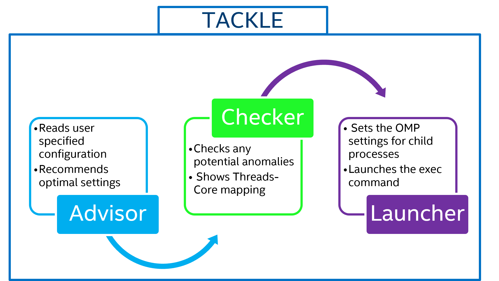

Tackle is a set of thread affinity tools namely, Advisor, Checker and Launcher. 

## Motivation
The primary motivation for writing this tool is to seamlessly deploy multiple deep learning (DL) inference models on Intel CPU's. Thread Affinity is imperative for getting best DL performance on CPU's as pinning threads to CPU cores avoids migration during execution, thereby preventing cache pollution. For example, matrix-multiplication performs 2x worse with missing/incorrect thread affinity settings. 

Launching multiple DL instances (with each instance spawning multiple threads) on CPU's requires the end user to understand the machine topology (# of cores, sockets, NUMA domains, hyper-threads) and then specifying the appropriate NUMA binding (to maximize memory locality and avoid cross-NUMA traffic) and thread affinity settings (to prevent either over-subscribing or under-subscribing CPU cores). This needs an automated solution as there are multiple DL topologies requiring different threading constraints executing on CPU SKU's with different core/threads/socket counts. 

As a use case, below is workflow for running 4 instances of ResNet using TensorFlow w/o and w/ Tackle. Without Tackle, this kind of scenario can quickly get cumbersome when one wants to deploy 10 instances on 4 different machine topologies:

- Without Tackle: 


- With Tackle:
```
[user@linux]$ ./tackle -w 4 -- python $HOME/tf-benchmarks/scripts/tf_cnn_benchmarks/tf_cnn_benchmarks.py 
--batch_size=64 --model=resnet50 --data_format NCHW --device cpu  --forward_only --mkl=true
--num_inter_threads 1 --num_intra_threads \${OMP_NUM_THREADS} --kmp_affinity \${KMP_AFFINITY}
```

## Checker:

In this mode, Tackle inspects the OpenMP affinity specified by user and reports potential anomalies based on CPU topology. It achieves this by spawning OpenMP Parallel regions to probe thread affinity. The following classes of affinity defects are identified -
- Missing affinity for a given thread
- Threads are floating among core siblings AKA Hyper-Threading cores
- Over-subscription of cpus
- Threads crossing socket boundary

Reports the Thread->Core affinity map as GraphViz dot output file (use, ```dot -Tpng tackle_affinity_map.gv > output.png``` to view it as image)

## Advisor:

For a given number of workers or/and threads, recommends the following -
- Number of threads
- Optimal OMP affinity based on machine topology
- NUMA domain based on thread placement

## Launcher:

This takes as input the number of workers, number of OpenMP threads/worker, path to execution command/script and optional log file names. The launcher would then start executing the target app (as multiple instances) with optimal affinity settings.

The affinity settings that Tackle reads/writes are values accepted by Intel OpenMP runtime only (aka KMP_AFFINITY runtime environment variable)

## Building Tackle
You will need the Intel C Compiler and Intel OpenMP runtime library. Run "make" and that will produce a binary called, *tackle*

## Tester
There is a bash shell script (tackle_tester.sh) that checks the various modes supported with different worker configs.

## List of options supported 
```
[user@linux]$ ./tackle -h
tackle [options] -- command

In the default mode, Tackle will take the command specified and launch it according to the options specified
Tackle has two other modes -- advisor, checker. In these modes, Tackle will only provide recommendations (advisor mode)
or report anomalies (checker mode) based on user input and machine topology

The following options are available depending upon the mode specified:
-m, --mode         : Either of advisor or checker.
-w, --num_workers  : Specifies the number of instances of command to launch. Default is 1.
-t, --num_thrs     : Specifies the number of threads to be used in each instance.
                     For number of workers > 1 and if the number of threads to
                     be used is not same among the workers, you can specify multiple
                     values, each delimited by a semi-colon(;). For eg. "5;8;10"
                     If the number of threads to be used is same across the workers,
                     you can just specify one value and it would be used for all workers
-i, --inter_op     : Not applicable for checker mode.
                     Number of processes a worker will spawn. Default is 1.
-a, --affinity     : Applicable only for checker mode.
                     Specifies the KMP_AFFINITY option for each worker delimited by semi-colon(;)
-e, --exec_cmd     : Not applicable for advisor and checker modes.
                     Specifies the command to launch for workers with different
                     exec commands, you can specify them delimited by a semi-colon(;)
                     If the same exec command is used for all workers, you have a choice to skip this
                     option and specify the exec command after the -- token. In all modes, no command will be launched by default.
-o, --out_file     : Not applicable for advisor and checker modes.
                     Specifies the path to the file to which worker stdout and stderr are written
                     If specified, a worker suffix(.w[0,1,..]) will be added to the end of the file
                     name. The default is to write stdout and stderr of each worker to file
                     named "tackle-worker-[0,1..].log" in the current directory.
```

## Examples
- Advisor mode: Recommend ideal thread affinity settings when using 4 processes with each process spawning 4, 10, 12 and 8 OpenMP threads respectively
```
[user@linux]$ ./tackle --mode advisor --num_workers 4 --num_thrs "4;10;12;8"
Machine topology:
        Number of sockets         = 2
        Physical cores per socket = 20
        Logical cores per socket  = 40
        Total physical cores      = 40
        Total logical cores       = 80
        Threads per core          = 2
        Hyper-Threading           = ON
        Number of NUMA nodes      = 2
        Socket-0 CPU(s)         : 0 1 2 3 4 5 6 7 8 9 10 11 12 13 14 15 16 17 18 19
        Socket-0 CPU(s) siblings: 40 41 42 43 44 45 46 47 48 49 50 51 52 53 54 55 56 57 58 59
        Socket-1 CPU(s)         : 20 21 22 23 24 25 26 27 28 29 30 31 32 33 34 35 36 37 38 39
        Socket-1 CPU(s) siblings: 60 61 62 63 64 65 66 67 68 69 70 71 72 73 74 75 76 77 78 79
        NUMA node-0 CPU(s)      : 0 1 2 3 4 5 6 7 8 9 10 11 12 13 14 15 16 17 18 19 40 41 42 43 44 45 46 47 48 49 50 51 52 53 54 55 56 57 58 59
        NUMA node-1 CPU(s)      : 20 21 22 23 24 25 26 27 28 29 30 31 32 33 34 35 36 37 38 39 60 61 62 63 64 65 66 67 68 69 70 71 72 73 74 75 76 77 78 79

Advisor Recommendations:
WID[0]:
        OMP_NUM_THREADS   = 4
        OMP Affinity      = granularity=fine,explicit,proclist=[0-3]
        Taskset CPU(s)    = 0-3,40-43
        NUMA membind      = -m0
WID[1]:
        OMP_NUM_THREADS   = 10
        OMP Affinity      = granularity=fine,explicit,proclist=[4-13]
        Taskset CPU(s)    = 4-13,44-53
        NUMA membind      = -m0
WID[2]:
        OMP_NUM_THREADS   = 12
        OMP Affinity      = granularity=fine,explicit,proclist=[14-25]
        Taskset CPU(s)    = 14-25,54-65
        NUMA membind      = -l
WID[3]:
        OMP_NUM_THREADS   = 8
        OMP Affinity      = granularity=fine,explicit,proclist=[26-33]
        Taskset CPU(s)    = 26-33,66-73
        NUMA membind      = -m1
```

- Launcher mode: Launch binary (```ls```) using 4 processes spawning maximum number of threads on the node with ideal affinity settings 
```
[user@linux]$ ./tackle --num_workers 4 -- ls
Machine topology:
        Number of sockets         = 2
        Physical cores per socket = 20
        Logical cores per socket  = 40
        Total physical cores      = 40
        Total logical cores       = 80
        Threads per core          = 2
        Hyper-Threading           = ON
        Number of NUMA nodes      = 2
        Socket-0 CPU(s)         : 0 1 2 3 4 5 6 7 8 9 10 11 12 13 14 15 16 17 18 19
        Socket-0 CPU(s) siblings: 40 41 42 43 44 45 46 47 48 49 50 51 52 53 54 55 56 57 58 59
        Socket-1 CPU(s)         : 20 21 22 23 24 25 26 27 28 29 30 31 32 33 34 35 36 37 38 39
        Socket-1 CPU(s) siblings: 60 61 62 63 64 65 66 67 68 69 70 71 72 73 74 75 76 77 78 79
        NUMA node-0 CPU(s)      : 0 1 2 3 4 5 6 7 8 9 10 11 12 13 14 15 16 17 18 19 40 41 42 43 44 45 46 47 48 49 50 51 52 53 54 55 56 57 58 59
        NUMA node-1 CPU(s)      : 20 21 22 23 24 25 26 27 28 29 30 31 32 33 34 35 36 37 38 39 60 61 62 63 64 65 66 67 68 69 70 71 72 73 74 75 76 77 78 79

Advisor Recommendations:
WID[0]:
        OMP_NUM_THREADS   = 10
        OMP Affinity      = granularity=fine,explicit,proclist=[0-9]
        Taskset CPU(s)    = 0-9,40-49
        NUMA membind      = -m0
WID[1]:
        OMP_NUM_THREADS   = 10
        OMP Affinity      = granularity=fine,explicit,proclist=[10-19]
        Taskset CPU(s)    = 10-19,50-59
        NUMA membind      = -m0
WID[2]:
        OMP_NUM_THREADS   = 10
        OMP Affinity      = granularity=fine,explicit,proclist=[20-29]
        Taskset CPU(s)    = 20-29,60-69
        NUMA membind      = -m1
WID[3]:
        OMP_NUM_THREADS   = 10
        OMP Affinity      = granularity=fine,explicit,proclist=[30-39]
        Taskset CPU(s)    = 30-39,70-79
        NUMA membind      = -m1

Thread --> Core Affinity Map:
        WID[0]          WID[1]          WID[2]          WID[3]
TID[0]  0               10              20              30
TID[1]  1               11              21              31
TID[2]  2               12              22              32
TID[3]  3               13              23              33
TID[4]  4               14              24              34
TID[5]  5               15              25              35
TID[6]  6               16              26              36
TID[7]  7               17              27              37
TID[8]  8               18              28              38
TID[9]  9               19              29              39

Checking affinity:
Checker Summary:
        WID[0] Checker did not detect any affinity defects for this worker threads
        WID[1] Checker did not detect any affinity defects for this worker threads
        WID[2] Checker did not detect any affinity defects for this worker threads
        WID[3] Checker did not detect any affinity defects for this worker threads


Launcher configuration:
WID[0]:
        OMP_NUM_THREADS = 10
        KMP_AFFINITY    = granularity=fine,explicit,proclist=[0-9]
        Exec program    : taskset -c 0-9,40-49 numactl -m0 ls  &> tackle-worker-0.log
        Output file     : tackle-worker-0.log
WID[1]:
        OMP_NUM_THREADS = 10
        KMP_AFFINITY    = granularity=fine,explicit,proclist=[10-19]
        Exec program    : taskset -c 10-19,50-59 numactl -m0 ls  &> tackle-worker-1.log
        Output file     : tackle-worker-1.log
WID[2]:
        OMP_NUM_THREADS = 10
        KMP_AFFINITY    = granularity=fine,explicit,proclist=[20-29]
        Exec program    : taskset -c 20-29,60-69 numactl -m1 ls  &> tackle-worker-2.log
        Output file     : tackle-worker-2.log
WID[3]:
        OMP_NUM_THREADS = 10
        KMP_AFFINITY    = granularity=fine,explicit,proclist=[30-39]
        Exec program    : taskset -c 30-39,70-79 numactl -m1 ls  &> tackle-worker-3.log
        Output file     : tackle-worker-3.log
```

- Checker mode: Check affinity anomalies when using 4 processes with each process spawning 4 OpenMP threads under "compact" affinity 
```
[user@linux]$ ./tackle --mode checker --num_workers 4 --num_thrs 4 --affinity compact
Machine topology:
        Number of sockets         = 2
        Physical cores per socket = 20
        Logical cores per socket  = 40
        Total physical cores      = 40
        Total logical cores       = 80
        Threads per core          = 2
        Hyper-Threading           = ON
        Number of NUMA nodes      = 2
        Socket-0 CPU(s)         : 0 1 2 3 4 5 6 7 8 9 10 11 12 13 14 15 16 17 18 19
        Socket-0 CPU(s) siblings: 40 41 42 43 44 45 46 47 48 49 50 51 52 53 54 55 56 57 58 59
        Socket-1 CPU(s)         : 20 21 22 23 24 25 26 27 28 29 30 31 32 33 34 35 36 37 38 39
        Socket-1 CPU(s) siblings: 60 61 62 63 64 65 66 67 68 69 70 71 72 73 74 75 76 77 78 79
        NUMA node-0 CPU(s)      : 0 1 2 3 4 5 6 7 8 9 10 11 12 13 14 15 16 17 18 19 40 41 42 43 44 45 46 47 48 49 50 51 52 53 54 55 56 57 58 59
        NUMA node-1 CPU(s)      : 20 21 22 23 24 25 26 27 28 29 30 31 32 33 34 35 36 37 38 39 60 61 62 63 64 65 66 67 68 69 70 71 72 73 74 75 76 77 78 79


Thread --> Core Affinity Map:
WID[0]TID[0] : 0 40
WID[0]TID[1] : 0 40
WID[0]TID[2] : 1 41
WID[0]TID[3] : 1 41
WID[1]TID[0] : 0 40
WID[1]TID[1] : 0 40
WID[1]TID[2] : 1 41
WID[1]TID[3] : 1 41
WID[2]TID[0] : 0 40
WID[2]TID[1] : 0 40
WID[2]TID[2] : 1 41
WID[2]TID[3] : 1 41
WID[3]TID[0] : 0 40
WID[3]TID[1] : 0 40
WID[3]TID[2] : 1 41
WID[3]TID[3] : 1 41

Checking affinity:
[ISSUE DETECTED]: Floating thread among core siblings - WID[0]TID[0] thread is floating among core-0 siblings: 0 40
[ISSUE DETECTED]: Floating thread among core siblings - WID[0]TID[1] thread is floating among core-0 siblings: 0 40
[ISSUE DETECTED]: Floating thread among core siblings - WID[0]TID[2] thread is floating among core-1 siblings: 1 41
[ISSUE DETECTED]: Floating thread among core siblings - WID[0]TID[3] thread is floating among core-1 siblings: 1 41
[ISSUE DETECTED]: Over-subscription - WID[0] requested number of threads 4 are mapped to fewer number of physical cores 2
[ISSUE DETECTED]: Floating thread among core siblings - WID[1]TID[0] thread is floating among core-0 siblings: 0 40
[ISSUE DETECTED]: Floating thread among core siblings - WID[1]TID[1] thread is floating among core-0 siblings: 0 40
[ISSUE DETECTED]: Floating thread among core siblings - WID[1]TID[2] thread is floating among core-1 siblings: 1 41
[ISSUE DETECTED]: Floating thread among core siblings - WID[1]TID[3] thread is floating among core-1 siblings: 1 41
[ISSUE DETECTED]: Over-subscription - WID[1] requested number of threads 4 are mapped to fewer number of physical cores 2
[ISSUE DETECTED]: Floating thread among core siblings - WID[2]TID[0] thread is floating among core-0 siblings: 0 40
[ISSUE DETECTED]: Floating thread among core siblings - WID[2]TID[1] thread is floating among core-0 siblings: 0 40
[ISSUE DETECTED]: Floating thread among core siblings - WID[2]TID[2] thread is floating among core-1 siblings: 1 41
[ISSUE DETECTED]: Floating thread among core siblings - WID[2]TID[3] thread is floating among core-1 siblings: 1 41
[ISSUE DETECTED]: Over-subscription - WID[2] requested number of threads 4 are mapped to fewer number of physical cores 2
[ISSUE DETECTED]: Floating thread among core siblings - WID[3]TID[0] thread is floating among core-0 siblings: 0 40
[ISSUE DETECTED]: Floating thread among core siblings - WID[3]TID[1] thread is floating among core-0 siblings: 0 40
[ISSUE DETECTED]: Floating thread among core siblings - WID[3]TID[2] thread is floating among core-1 siblings: 1 41
[ISSUE DETECTED]: Floating thread among core siblings - WID[3]TID[3] thread is floating among core-1 siblings: 1 41
[ISSUE DETECTED]: Over-subscription - WID[3] requested number of threads 4 are mapped to fewer number of physical cores 2
Checker Summary:
        WID[0] threads are not affinitized and are floating on multiple cpus
        WID[0] affinity settings lead to cpu over-subscription
        WID[1] threads are not affinitized and are floating on multiple cpus
        WID[1] affinity settings lead to cpu over-subscription
        WID[2] threads are not affinitized and are floating on multiple cpus
        WID[2] affinity settings lead to cpu over-subscription
        WID[3] threads are not affinitized and are floating on multiple cpus
        WID[3] affinity settings lead to cpu over-subscription
```
